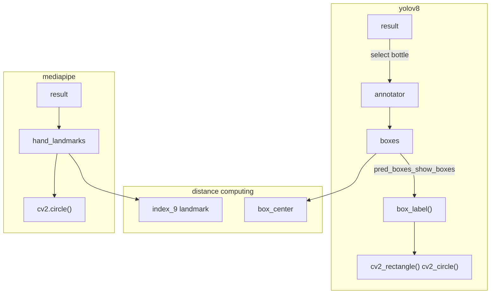

# YOLOv8 + Mediapipe to assist the daily life of patients with hemiplegia grasping

>Tips: Here I may change the source code of     ultralytics to improve the performance of this project.
## how to run the container
Firstly, we need to  build the image using the Dockerfile(you should run the following command in the parent folder of Dockerfile )
```
docker build -t yolo-medpip-eletron
```
Then run the container 
```
sudo docker run -dit \
--name=yolo_mediapip_eletronic \
--privileged  \
-v /dev:/dev \
-v /tmp/.X11-unix:/tmp/.X11-unix  \
-e DISPLAY=unix$DISPLAY \
-w /usr/src \
--net=host \
--ipc=host \
--gpus all \
yolo-medpip-eletron
```


## This is the plotting call stack

Tips:
- add name property `name_handler` in the Box class for the result extract in the main function, which is assigned in the `Results.plot()`.
    ```
    d.name_handler = label
    ```
- and the final 2D box center is also assigned in the `Results.plot().annotate.box_label()` function.
    ```
    self.center_handler = 0
    ```

## hand online 3D visualization
open a terminal
```
python3 mediapipe_3d.py
```
open another terminal
```
python3 extract_mediapipe_hand.py
```


## @ TODO
- 读对面的，记录电刺激参数的帧末尾处理，记录，下次读进来作为，读杯子的宽度


# Appendix
here is the official hand detection output 


### ```combine.py``` 是最终的运行文件
